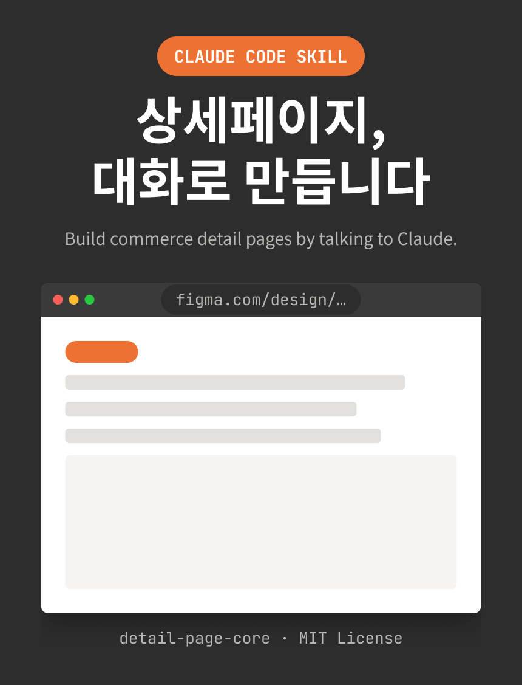

# KEZ-ProductPage-skill

**커머스 상세페이지를 Figma 캔버스에 직접 제작·수정하는 Claude Code 스킬** (`detail-page-core`)

말로 요청하면("리뷰 섹션 만들어줘") Claude Code가 Figma 공식 MCP를 통해 실제 Figma 파일에 오토레이아웃 프레임을 생성·편집합니다. 디자인 규칙을 **측정값이 아니라 원리**로 정리한 디자인 시스템이 내장되어 있어, 어느 브랜드에든 그 브랜드의 색·서체를 꽂아 재사용할 수 있습니다.

<!-- TODO(공개 전): 히어로 스크린샷 — 완성된 상세페이지 캔버스 전경 1장 -->
<!--  -->

<!-- TODO(공개 전): 데모 영상 — "섹션 만들어줘" → 캔버스에 생성되는 과정 30초~1분 -->

---

## 핵심 설계 — 2층 구조

이 스킬의 모든 규칙은 새 제품·새 브랜드에서 재사용 가능해야 한다는 원칙으로 만들어졌습니다.

| 층 | 위치 | 내용 |
|---|---|---|
| **브랜드 무관 패턴** | `references/design-dna/` | 색·조형·타이포·카피·섹션·이미지의 결정 규칙. 채도/명도/색조 관계, 크기·굵기 위계, 상황 분기("이럴 땐 이렇게")로만 서술. 절대 HEX/px 없음 |
| **브랜드 프로파일** | `references/brands/<이름>.md` | 그 패턴의 슬롯에 들어가는 실제 HEX·서체·규격. 브랜드마다 파일 하나. `_template.md`에서 온보딩 |

색·서체를 정할 땐 항상 **패턴 문서 + 브랜드 문서를 합쳐** 결정합니다. 브랜드 값이 미정이면 패턴만으로 지어내지 않고 유저에게 확인받습니다.

## 요구사항

- [Claude Code](https://claude.com/claude-code) (CLI 또는 데스크톱 앱)
- Figma 계정 + **Figma 공식 원격 MCP** 등록:

```bash
claude mcp add --scope user --transport http figma https://mcp.figma.com/mcp
```

> `--scope user`로 등록해야 모든 세션에서 자동 로드됩니다. 등록 후 첫 사용 시 브라우저에서 Figma OAuth 인증이 필요합니다.
> 스킬은 Figma MCP의 `use_figma` 도구(Plugin API 실행)를 사용합니다. 이 도구는 베타이므로 결과물은 스크린샷으로 재검증합니다(스킬에 검증 절차 내장).

## 설치

```bash
git clone https://github.com/HarinJin/KEZ-ProductPage-skill.git
cp -r KEZ-ProductPage-skill/detail-page-core ~/.claude/skills/
```

Claude Code 재시작 후, "상세페이지"가 들어간 요청을 하면 스킬이 자동 발동합니다.

## 사용 방법

### 1) 브랜드 프로파일 온보딩 (브랜드당 최초 1회)

작업할 브랜드의 프로파일이 없으면 스킬이 온보딩을 안내합니다:

1. `references/brands/_template.md`를 `references/brands/<브랜드이름>.md`로 복사
2. 기존 상세페이지가 있으면 Figma에서 **실측**해 슬롯(중립축/액센트/의미색/서체/규격)을 채움
3. 실측만으로 안 정해지는 값(브랜드 대표 색조·톤·서체)은 유저에게 확인받아 확정
4. 값이 미정인 슬롯은 "미정"으로 표기하고 해당 부분 제작은 보류 — **지어내지 않음**

<!-- TODO(공개 전): 온보딩 대화 스크린샷 1장 -->

### 2) 제작 요청

브랜드/제품을 지정해 요청합니다. 트리거 예시:

- "○○ 제품 상세페이지 만들어줘"
- "리뷰 섹션 / FAQ 섹션 / 장점 요약 섹션 / 성분표 섹션 만들어줘"
- "피그마 상세페이지 이 부분 수정해줘"

### 3) 작업 흐름 (스킬이 강제하는 절차)

1. **인터뷰 선행** — 착수 전 브랜드·범위·카피 소스·자산을 확인 (`00-interview.md`). 법정 고지문·리뷰 콘텐츠·미확정 카피는 추측 금지
2. **전체 신규는 스켈레톤 우선** — placeholder 프레임으로 전체 구성 승인 후 세부 제작
3. **한 번에 한 구간만** — 섹션 단위 제작 → 스크린샷 검증 → 유저 확인 → 다음
4. **구조 정돈 없이 완료 보고 금지** — 역할 한글명, 의미단위 그룹화, 중첩 오토레이아웃

<!-- TODO(공개 전): 제작 과정 스크린샷 2~3장 (스켈레톤 → 섹션 완성) -->

### 4) 대량 제작 — 병렬 오케스트레이션

섹션이 많을 때(예: 크라우드펀딩 페이지 13섹션)는 `orchestration.md`의 감독-빌더 패턴을 사용합니다: 감독이 폰트 전수검증·공용 조형 고정·카피 소스 고정을 1회 준비 → 빌더 에이전트들에게 복붙 프롬프트 템플릿으로 배분 → 웨이브마다 재배치(re-flow)와 검수 체크리스트 실행.

## 문서 구조 (13파일, 약 1,500줄)

```
detail-page-core/
├── SKILL.md                        ← 라우터: 상황→문서 매핑 + 절대 규칙. 전부 미리 읽지 않음
└── references/
    ├── 00-interview.md             ← 착수 전 확인 체크리스트, 추측 금지 3종
    ├── design-dna/                 ← 브랜드 무관 패턴 (값 없음, 원리만)
    │   ├── 01-color.md             ← 색 3층 구조(중립축/액센트/의미색), 배경별 대비, 신규 브랜드 실측 절차
    │   ├── 02-grouping-layout.md   ← 오토레이아웃 계층, 의미단위 그룹화, 조형=역할 신호, 폭 체계
    │   ├── 03-typography.md        ← 크기 4단 서열, 굵기=강조 세기, 서체 3역할, 최소 텍스트 크기
    │   ├── 04-copy.md              ← 역할별 카피 목적·길이, 넘침 시 대응, 이모지 용법
    │   ├── 05-page-purpose.md      ← 섹션 카탈로그(심리 과업 기반), 순서 표준, 펀딩 페이지 변주
    │   └── 06-image-treatment.md   ← 사진 역할 판정→삽입 4방식, 블렌드, 그림자 언어
    ├── brands/
    │   └── _template.md            ← 브랜드 프로파일 템플릿 (온보딩 절차 포함)
    ├── build-recipes.md            ← 제작 5단계 순서, 재사용 코드(말풍선·형광펜·격리카드·블렌드)
    ├── figma-mcp.md                ← use_figma API 규칙 (폰트 로딩, 연산 분할, 원자성)
    ├── orchestration.md            ← 병렬 섹션 제작 감독 절차
    └── troubleshooting.md          ← 증상→해법 색인 T1~T14 (전부 실전 실측 검증)
```

## 알려진 한계

- `use_figma`는 베타 — 생성 결과는 항상 스크린샷으로 재검증 필요 (스킬이 절차로 강제)
- 벡터/마스크 path 데이터는 MCP로 추출 불가 → 복잡한 장식 벡터는 기존 노드 clone 재사용이 실질 해법
- 저해상도 미리보기에서 겹침이 과장돼 보일 수 있음 (고해상도 재조회로 판별)

## 개발 배경

실제 운영 중인 커머스 브랜드들의 상세페이지 수십 장을 Figma에서 실측해 패턴을 도출하고, 크라우드펀딩 상세페이지 13섹션 병렬 제작 실전에서 나온 함정·낭비를 역주입해 강화한 뒤, 브랜드 고유 값(HEX·서체·노드ID)을 전부 제거해 추출한 공용판입니다. `troubleshooting.md`의 T1~T14는 전부 실전에서 재현·검증된 항목입니다.

## 라이선스

[MIT](LICENSE)
